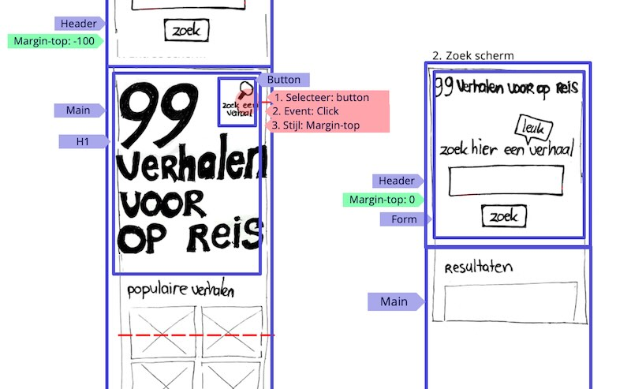

# Fix the Flow - Interactive Website

## Programming User Interacion

Leer met het JavaScript 3 stappenplan en CSS interactie coderen.

## Aanpak

Als een gebruiker interactie heeft met een website, moet je goede feedback/feedforward ontwerpen en maken. Zo weet een gebruiker wat die kan verwachten, en of de actie gelukt is. 

Een interactie uit jouw _user story_ codeer je met HTML, CSS en JS. Tijdens de code/design review komende vrijdag krijg je feedback op je code. Volgende week vrijdag ga je jouw interactie leren testen met een _User Test_.


## De Console en het Document Object Model (DOM)

Voordat we zelf JavaScript gaan schrijven, heb je nog een aantal tools en inzichten nodig. De _Console_ van je browser developer tools ga je veel zien, dus laten we daar eerst in duiken, net als in week 1 van de opleiding.

De afgelopen vier sprints heb je voornamelijk gewerkt met HTML en CSS. Met HTML bouw je zoals je weet _documenten_, en met JavaScript gaan we een interactie toevoegen aan die documenten. Met JavaScript heb je toegang tot het volledige _Document Object Model_ (de _DOM_). Alle HTML die je schrijft, wordt als een boomstructuur (een _tree_) door de browser intern bijgehouden. In je developer tools en in de Console kun je de DOM onderzoeken.

Het _inspecteren_ van elementen heb je dus al vaak gedaan. Als je in de Inspector een element selecteert, krijg je hier in de Console een referentie heen, via een _variabele_ genaamd `$0`. Je kunt hiermee de DOM onderzoeken.


### Opdrachten Console en DOM

Ga in de browser naar je eigen project, open de Console en schrijf op het whiteboard uit hoeveel elementen de pagina waar je aan werkt bestaat. Dit kun je doen door `document.querySelectorAll('*').length` uit te voeren.

Zorg dat je in de Console een lijst van alle _kinderen_ uit je `<head>` element te zien krijgt, door `document.querySelector('head').children` uit te voeren.

Inspecteer het element waarmee je de interactie van jouw user story wilt _activeren_ (waarschijnlijk een button). Als je die nog niet hebt, inspecteer dan een ander willekeurig element. Ga naar de Console en typ `console.log($0)`.

Voer `$0.classList.add('awesome')` uit in de Console, en daarna weer `console.log($0)`. Is er een `awesome` `class` bijgekomen?

Voer `$0.hidden = true` uit. En daarna `$0.hidden = false`.

Voer `$0.textContent = 'JS is nog steeds tof!'` uit.

Tik `document.` in je Console, en scroll door de lijst met suggesties. Schrijf op het whiteboard uit die lijst een term waar je meer over wilt weten.

💪 Toe aan een uitdaging? Kijk eens of je met `document.documentElement.style.setProperty()` een custom property uit CSS aan kunt passen.

### Bronnen

- [console @ MDN](https://developer.mozilla.org/en-US/docs/Web/API/console)
- [console.log() @ MDN](https://developer.mozilla.org/en-US/docs/Web/API/console/log_static)
- [Introduction to the DOM @ MDN](https://developer.mozilla.org/en-US/docs/Web/API/Document_Object_Model/Introduction)


## Het 3 stappenplan, waarmee je (bijna) alles kan

Om een interactie te coderen gebruik je in javascript het 3 stappenplan. Eerst moet je het element in de DOM selecteren waar je iets mee wil, daarna koppel je daar een event aan, daarna kan je met een CSS class feedback tonen. 

### Stap 1: Element in de DOM selecteren
Stap 1 van ons stappenplan is het _selecteren_ van een geschikt element, waarmee je de interactie gaat _activeren_. Je wilt bijvoorbeeld dat als iemand op een button klikt (of deze met het toetsenbord activeert), er iets gebeurt op de pagina. Je HTML ziet er bijvoorbeeld zo uit:

```html
<button class="show-more">Toon meer</button>
<p class="info">Dit wordt nog niet getoond.</p>
```

In CSS heb je die button met een _class selector_ als _feedforward_ ronde hoeken, een pointer en een icoontje gegeven, zodat de gebruiker weet dat er iets te doen is. De alinea met tekst wordt nog niet getoond.

```css
.show-more {
    border-radius: .4em;
    cursor: pointer;

    &::after {
        content: ' ⬇️' / '';
    }
}

.info {
    display: none;
}

/* Deze 'info-visible' class gaan we er met JS straks op zetten */
.info-visible {
    display: block;
}
```

In JavaScript kun je de button _selecteren_ met `document.querySelector()`, gecombineerd met de _class selector_ `.show-more`. Het resultaat kun je in een _variabele_ opslaan, die je net als bij CSS _custom properties_ kunt noemen zoals je wilt. Met het `let` _keyword_ maak je een variabele aan:

```js
let showMoreButton = document.querySelector('.show-more');
```

Aan de `document.querySelector()` _functie_ geef je dus een _CSS selector_ mee als _string_ (tussen 'aanhalingstekens'). Dit kan _elke_ selector zijn die je ook in CSS kunt gebruiken. Vervolgens kun je hier iets mee doen.

De basis voor Stap 1 is dus het _selecteren_ van het element die de interactie laat beginnen.

### Stap 2: Event koppelen
Stap 2: Wacht tot de gebruiker ook echt iets doet. In veel gevallen gaat dit om wachten op het _click event_; je wilt dat er iets gebeurt als iemand op jouw button klikt. Hiervoor kun je met `addEventListener()` een _event_ toevoegen aan jouw element. Komende maandag gaan we hier dieper op in met de UI Events deeltaak, maar voor nu is het belangrijk om dit te begrijpen:

```js
let doSomething = function() {
    alert('Het werkt!');
}

showMoreButton.addEventListener('click', doSomething);
```

We hebben een _functie_ aangemaakt en in een variabele opgeslagen, genaamd `doSomething` (die je ook hier kunt noemen zoals je wilt). Met `addEventListener` hebben we die functie gekoppeld aan het _click event_. Hierdoor wordt de `doSomething` functie _aangeroepen_, zodra iemand op de button klikt. Dit hadden we ook met een _anonieme functie_ kunnen schrijven, wat hetzelfde doet:

```js
showMoreButton.addEventListener('click', function() {
    alert('Het werkt!');
});
```

De basis voor Stap 2 is dus `addEventListener`, een _event_ (vaak `'click'`), en een _callback_ functie, die pas later aangeroepen wordt.

### Stap 3: Feedback tonen met een CSS class
In Stap 3 geef je feedback aan de gebruiker. Dit kun je doen door bijvoorbeeld iets te veranderen op de pagina, iets toe te voegen, iets te animeren, ergens heen te scrollen, iets te openen, een geluidje af te spelen, etc. In de meeste gevallen wil je de styling van een bepaald HTML element veranderen, of een _class_ aan- of uitzetten.

Je weet dat je op elk HTML element een _class_ kunt zetten. En misschien inmiddels ook dat je _meerdere_ classes op een HTML kunt zetten, bijvoorbeeld: `<section class="about font-large">...</section>`. Elk element heeft dus een _lijst_ classes (ook al is het er vaak maar één). Via de `classList` _property_ van een DOM element, heb je in JavaScript toegang tot die lijst. Een aantal voorbeelden:

```js
document.body.classList.add('dark-mode'); // → <body class="dark-mode">

document.querySelector('section').classList.remove('font-large'); // → <section class="about">

document.querySelector('h1').classList.toggle('highlighted'); // → <h1 class="highlighted">, <h1 class="">, <h1 class="highlighted">, <h1 class="">, <h1 class="highlighted">...
```

In dit geval willen we waarschijnlijk zoiets:

```js
// Stap 1
let showMoreButton = document.querySelector('.show-more');

// Stap 2
showMoreButton.addEventListener('click', function() {

    // Stap 3
    document.querySelector('.info').classList.add('info-visible');
});
```

In CSS _matcht_ na klikken op de button de `info-visible` class ook, waardoor de `<p>` getoond wordt. In JavaScript heb je dus vaak maar een paar regels code nodig om iets interactiefs te maken. Transities en animaties kun je verder helemaal in CSS doen. En je kunt je volledig richten op goede en duidelijke feedforward en feedback. Uiteindelijk maak je de dingen voor eindgebruikers.

### Opdracht het 3 stappenplan in de console

Selecteer via de Console, met behulp van `document.querySelector()`, het element waarop je jouw interactie wilt laten werken, en toggle een `class` op dat element, door de `classList` te gebruiken. Controleer of dat gelukt is via de Inspector.

### Bronnen

- [If you only know one thing about JavaScript, this is what I would recommend](https://css-tricks.com/video-screencasts/150-hey-designers-know-one-thing-javascript-recommend/)
- [querySelector @ MDN](https://developer.mozilla.org/en-US/docs/Web/API/Document/querySelector)
- [addEventListener @ MDN](https://developer.mozilla.org/en-US/docs/Web/API/EventTarget/addEventListener)
- [classList @ MDN](https://developer.mozilla.org/en-US/docs/Web/API/Element/classList) 


## Van Comments naar Code

JavaScript is een _imperatieve_ programmeertaal. Dit houdt in dat je alle opdrachten die uitgevoerd worden zelf moet schrijven, in de volgorde die jij wilt. HTML en CSS zijn _declaratief_, waarmee je vooral beschrijft _wat_ er moet gebeuren, maar niet _hoe_. Dit maakt coderen in JavaScript heel anders. In CSS beschrijf je bijvoorbeeld zoiets:

```css
p {
    color: red;
}
```

Hoe de browser alle `<p>` elementen selecteert, daar hoef je je nu niet druk over te maken.

Als je ditzelfde in JavaScript zou willen doen, moet je elke stap uitschrijven:

```js
// Selecteer alle p elementen, en sla die op in een variabele
// Wandel langs alle p elementen
// Voor elk p element → verander de kleur naar rood
```

Zeker in het begin is dit even wennen. Wat enorm helpt bij deze nieuwe taal, is de verschillende stappen die je wilt nemen eerst uitschrijven als _comments_, zoals in het voorbeeld hierboven. Zelfs als je nog niet weet welke code je moet schrijven, kun je op deze manier wel alvast een _plan_ maken. En om hints of feedback vragen over hoe je dit probleem op kunt lossen. (Wees zorgvuldig met ChadGPT om hulp vragen, want die maakt het vaak ingewikkelder dan nodig. Ook ontbreekt er vaak context, die jij wél weet.)

Het 3 stappenplan kun je dus ook eerst uitschrijven in _comments_:

```js
// 1. Selecteer de button waarmee ik mijn menu open
// 2. Wacht tot iemand erop klikt
// 3. Verander de class van mijn <nav>, zodat deze zichtbaar wordt
```

Dit is een prima begin, wat je daarna uit kunt werken:

```js
// 1. Selecteer de button waarmee ik mijn menu open
let button = document.querySelector('button')
// 2. Wacht tot iemand erop klikt
button.addEventListener('click', function() {
    // 3. Verander de class van mijn <nav>, zodat deze zichtbaar wordt
    document.querySelector('nav').classList.add('nav-visible')
})
```

Vergeet niet dat HTML, CSS en JS alledrie andere regels hebben, omdat het totaal verschillende talen zijn. Als je in HTML en CSS per ongeluk een tikfout maakt, negeert een browser die vaak, en gaat die gewoon door met de rest van de pagina. In JS gaat het bij een tikfout iets sneller mis. Zodra de browser een fout in JS tegenkomt, wordt de rest niet meer uitgevoerd, en zie je een fout in je Console. Controleer die Console dus regelmatig als iets niet werkt. Gebruik de Console ook voor het _debuggen_ van je code en het controleren van je aannames.

In veel gevallen kan het handig zijn om `console.log()` te gebruiken, en het resultaat te inspecteren:

```js
// 1. Selecteer de button waarmee ik mijn menu open
let button = document.querySelector('button')

// Even dubbelchecken of ik wel de juiste button geselecteerd heb..
console.log(button)

// 2. Wacht tot iemand erop klikt
button.addEventListener('click', function() {
    // 3. Verander de class van mijn <nav>, zodat deze zichtbaar wordt
    document.querySelector('nav').classList.add('nav-visible')
})
```

Veel code in JavaScript is niet per se fout, maar doet alleen iets anders dan je verwachtte. Leer jezelf het gebruik van `console.log()` in je code aan, en test regelmatig je werk.

### Opdrachten interactie coderen 

Als je je interactie hebt ontworpen in een wireflow. Kan je een breakdown maken van de HTML elementen die je nodig hebt voor de interactie, de CSS styling, en het 3 stappenplan in JS. Dat ziet er bijvoorbeeld zo uit: 



Schrijf het plan voor je interactie in _comments_ uit in je JavaScript bestand, dat je via een `<script>` tag linkt aan je code. Als je al JavaScript uit een eerdere (video) tutorial hebt—of ChadGPT al iets voor je hebt laten schrijven—is dit het moment om dat weg te gooien, opnieuw te beginnen, en nieuwe dingen te leren.

Vraag op het plan dat je in comments uitgeschreven hebt feedback van een docent of mentor. Werk je interactie uit aan de hand van het 3 stappenplan. Laat je comments gewoon staan bij je code, zodat je inzichtelijk maakt hoe je te werk bent gegaan, en eventuele (denk)foutjes makkelijk terug kunt vinden.

Het kan goed zijn dat je vaak switcht tussen HTML, CSS en JS.

Commit je werk als je klaar bent, en noem in je commit message het issue nummer van je user story, zodat deze gekoppeld zijn. Vrijdag krijg je hierop een code/design review.


💪 Toe aan een uitdaging? Onderzoek de _methods_ `querySelector` en `querySelectorAll`, maak demo's in je learning Journal en schrijf in eigen woorden wat ze doen. Doe hetzelfde voor de _method_ `classList`.


### Bronnen

- [Use JavaScript within a webpage @ MDN](https://developer.mozilla.org/en-US/docs/Learn/HTML/Howto/Use_JavaScript_within_a_webpage)
- [Comments in JS @ MDN](https://developer.mozilla.org/en-US/docs/Web/JavaScript/Reference/Lexical_grammar#comments)
- [JS Fundamentals @ FDND](https://github.com/fdnd-task/js-fundamentals)
- [What is JavaScript? MDN beginner's JavaScript course](https://developer.mozilla.org/en-US/docs/Learn/JavaScript/First_steps/What_is_JavaScript)
